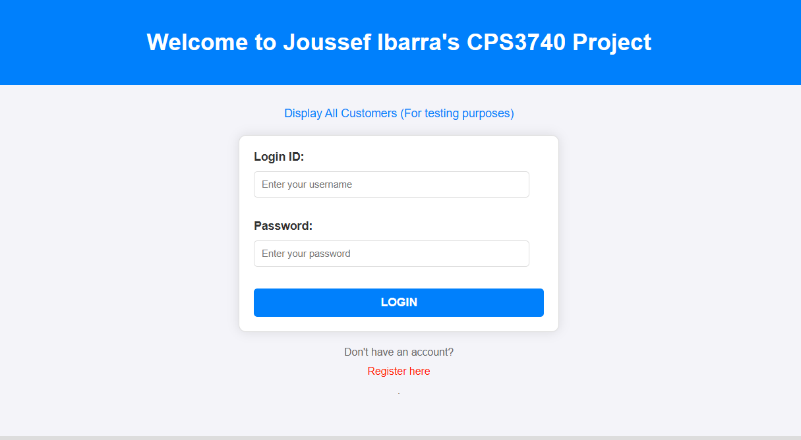
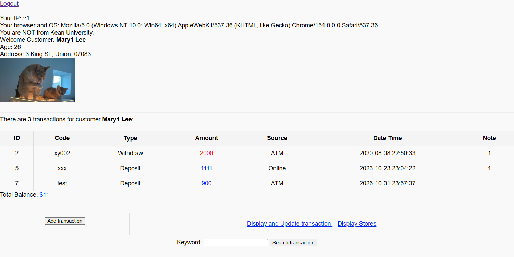
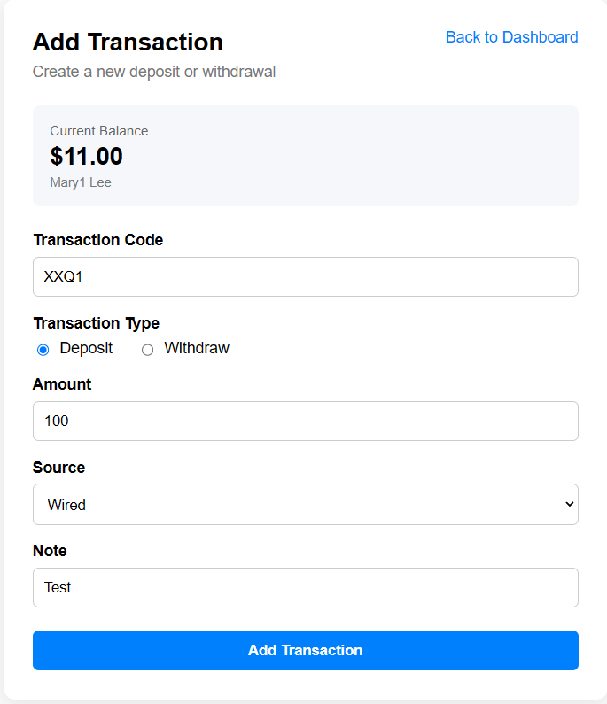
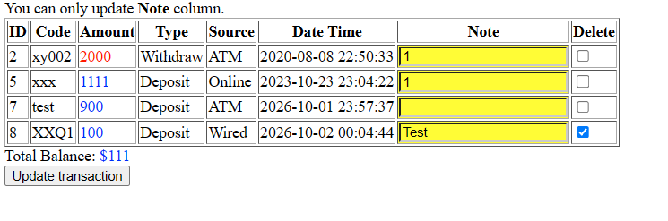

# Transaction Management System

A database-driven web application developed as a university Computer
Science project using PHP and MySQL.

The application allows users to authenticate, view their account
information and transaction history, and manage financial transactions
through a web interface.

## Features

- User authentication
- Customer account dashboard
- Transaction history
- Automatic account balance calculation
- Add deposit and withdrawal transactions
- Prevent withdrawals that exceed the available balance
- Validate transaction amounts and transaction codes
- Search transactions by keyword
- Update transaction notes
- Delete transactions
- Display transaction sources and store information
- MySQL database integration

## Technologies

- PHP
- MySQL
- HTML
- CSS
- SQL

## Application Flow

1. The user logs in with an existing account.
2. The application retrieves the customer's information from the database.
3. The customer's transaction history and current balance are displayed.
4. The user can add deposits or withdrawals.
5. Transactions can be searched, updated, or deleted.
6. Changes are stored in the MySQL database.

## Screenshots

### Login

### Customer Dashboard

### Add Transaction

### Manage Transactions

## About

This project was originally developed as part of a university Computer
Science course to demonstrate database-driven web development.

The application demonstrates PHP/MySQL integration, SQL queries,
authentication, input validation, transaction processing,
and dynamic generation of web content.
