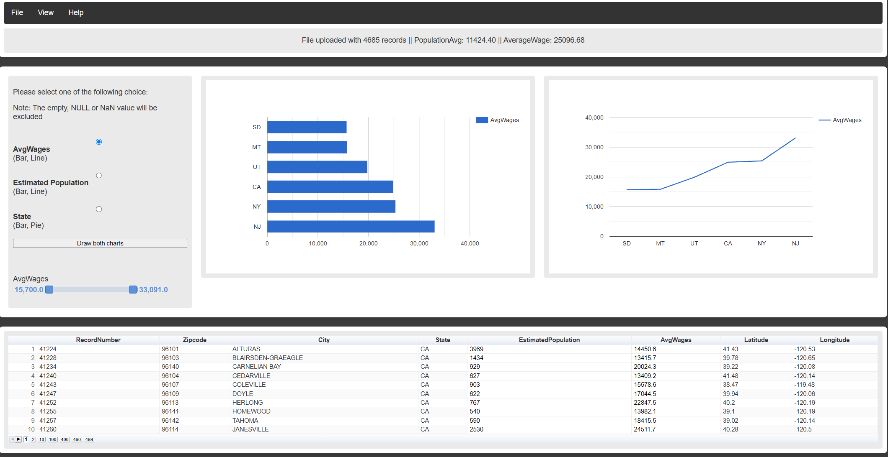
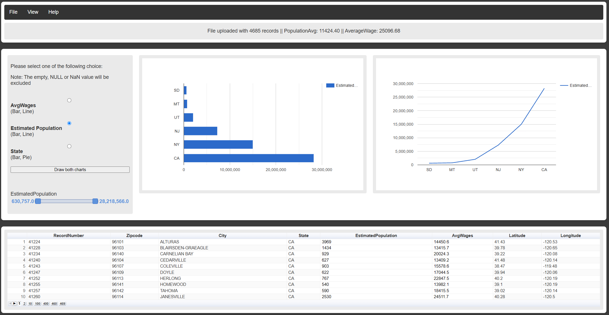
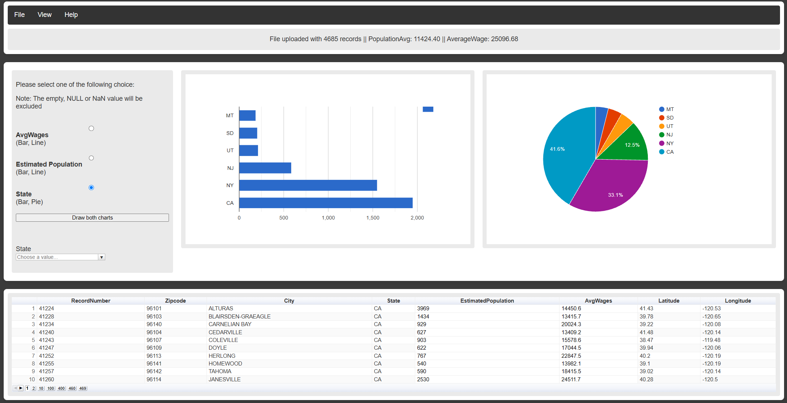
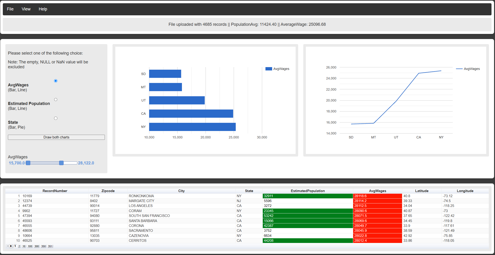

# ZIP Code Data Visualizer

A web-based data visualization application developed as a university
Computer Science project.

The application loads ZIP code datasets and allows users to explore
population, wage, and state-level data through interactive charts,
filters, and tables.

## Features

- Load ZIP code datasets from CSV files
- Retrieve ZIP code data from a MySQL database
- Load and visualize datasets containing thousands of records
- Tested with a CSV dataset containing 4,685 records
- Display records in an interactive, paginated data table
- Calculate average population and wage statistics
- Aggregate data by U.S. state
- Visualize average wages using bar and line charts
- Visualize estimated population using bar and line charts
- Visualize record distribution by state using bar and pie charts
- Filter wage and population data using interactive range controls
- Filter table records by individual states
- Explore unusual or extreme values by narrowing data ranges
- User authentication and saved settings functionality
- Additional geographic and D3-based visualizations

## Technologies

- JavaScript
- PHP
- HTML
- CSS
- MySQL
- Google Charts
- D3.js
- jQuery

## Screenshots

### Average Wage Visualization

Average wage data aggregated by state and displayed using interactive
bar and line charts.

### Estimated Population Visualization

Estimated population data aggregated by state with interactive
visualization and filtering.

### State Distribution

The application can group ZIP code records by state and display the
distribution using bar and pie charts. Users can select individual
states to filter the data table.

### Interactive Data Filtering

Interactive controls allow users to narrow the displayed data and
explore specific ranges, including unusual or extreme values.

## How It Works

1. A ZIP code dataset is loaded from a CSV file.
2. The application processes the records and calculates population
   and wage statistics.
3. Users select the type of data they want to visualize:
   - Average Wages
   - Estimated Population
   - State
4. The application aggregates the selected data and generates the
   appropriate charts.
5. Interactive filters can be used to narrow the dataset.
6. The data table updates to display records matching the selected
   filters.

## Data Visualizations

The application provides several ways to explore the dataset:

- Bar charts
- Line charts
- Pie charts
- Geographic visualization
- Interactive data tables
- D3-based visualization

## Database Functionality

The project also includes PHP and MySQL functionality for loading data
from a database and user authentication.

## About

This project was originally developed as a university Computer Science
project.

The project demonstrates working with large datasets, data processing,
interactive visualization, filtering, database integration, and
client/server web development.

The application currently runs locally using a PHP and MySQL
environment.

